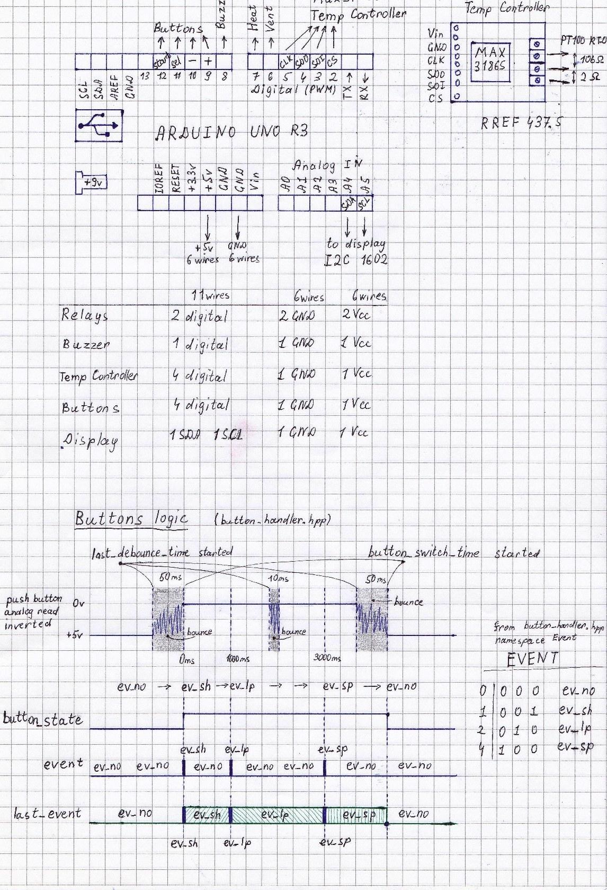

# High precision PID controller

**Arduino based high precision PID controller (C++)**

Based on Arduino Uno R3 / ATmega328P and 1602 LCD
 - Used PT100 RTD high accuracy resistance thermometer 
 - Used MAX31865 Analog-to-Digital converter (SPI interface)
 - Used 2 relays for heater and ventilator
 - Implemented 4 multifunctional buttons for parameters control, start/stop
 - Implemented mode/flow/power control and fault detection algorithms

The schematic of the PID controller

 

Hardware implemetation of the PID controller

